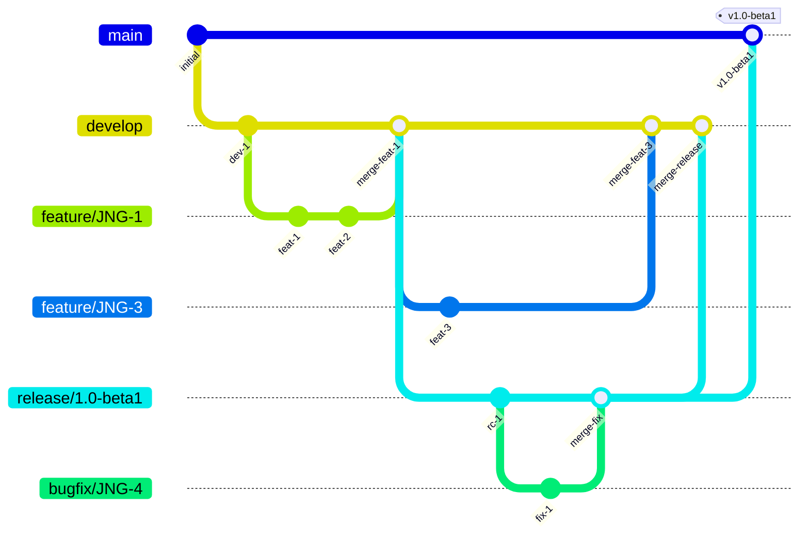
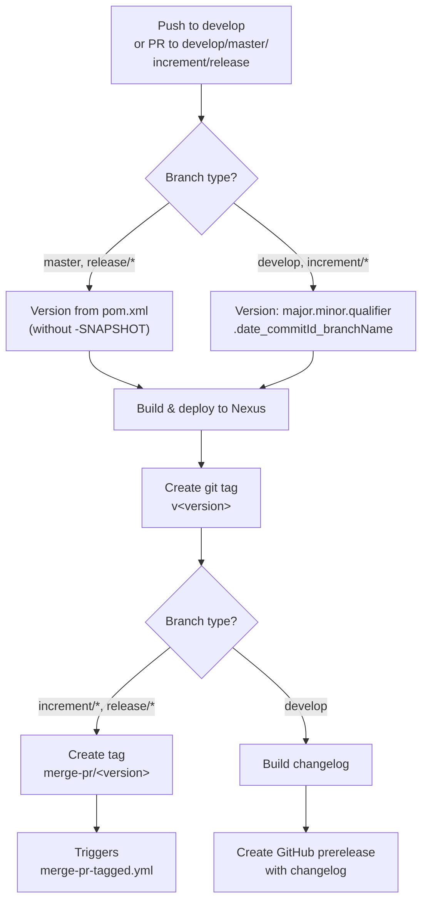
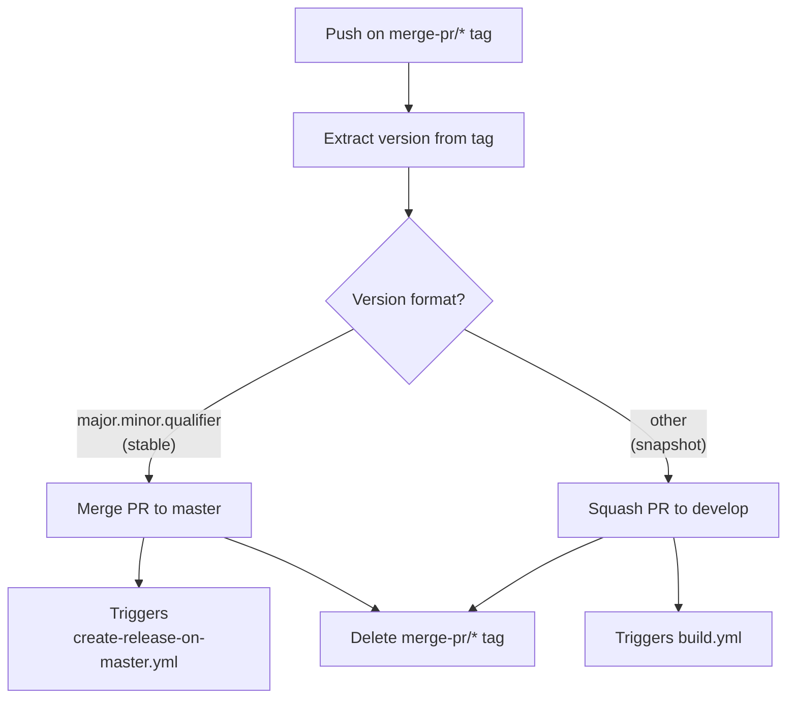
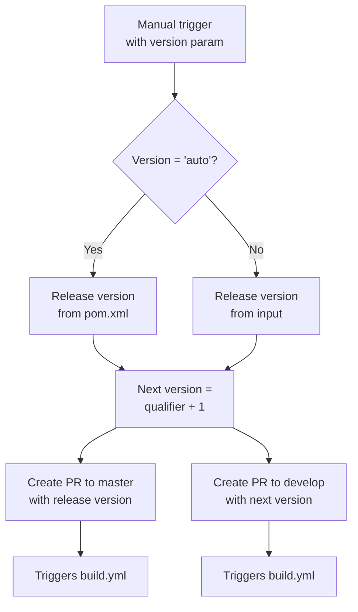

# CI/CD Flow — Development Versions and Branch Handling

This document describes the branching strategy, versioning policy, and GitHub Actions workflows used by this project.

## Branches

The versioning policy follows [GitFlow](https://www.atlassian.com/git/tutorials/comparing-workflows/gitflow-workflow) with the following branch types:

| Branch Pattern | Purpose | Based On |
|----------------|---------|----------|
| `develop` | Latest development sources of the active version | — |
| `feature/JNG-NNN_short_summary` | New features for the active version | `develop` |
| `(release/)X.Y.Z` | Release stabilization branches (`release/` prefix reserved for CI) | `develop` |
| `bugfix/JNG-NNN_short_summary` | Bug fixes applied to release branches, then merged forward | release branch |
| `support/JNG-NNN_short_summary` | Minor changes for a previous release, merged back to release branch | release branch |
| `master` | Latest released sources of the active version | release branch |
| `hotfix/JNG-NNN_short_summary` | Emergency fixes applied to both release and master branches | `master` |

## Version Numbers

Version numbers follow semantic versioning, with these rules:

| Event | Version Change |
|-------|---------------|
| Starting a feature branch | No change |
| Starting a release branch | 2nd number on `develop` is incremented |
| Bugfix on release branch | No change (fixes go into the release before it ships) |
| Starting a support branch | 3rd number is incremented |
| Starting a hotfix branch | 4th number is incremented |

## GitHub Actions Workflows

### build.yml — Main Build Pipeline

Triggered on pushes to `develop` and pull requests targeting `develop`, `master`, `increment/*`, or `release/*`.

### merge-pr-tagged.yml — Auto-Merge After Build

Triggered when a `merge-pr/*` tag is pushed.

### create-release-on-master.yml — Master Branch Release

Triggered on pushes to `master`. Gets the version from the tag, builds a changelog, and creates a GitHub release marked as the latest.

### release.yml — Manual Release Trigger

Manually triggered with a version parameter (either `'auto'` to use the pom.xml version, or a specific `major.minor.qualifier`).

## Development Rules

> **Important:** There is no commit without a ticket number. Every pull request and commit must include a JIRA reference like `JNG-xxx`.

Issue tracking: [JIRA dashboard](https://blackbelt.atlassian.net/jira/dashboards)
