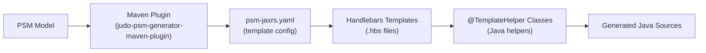
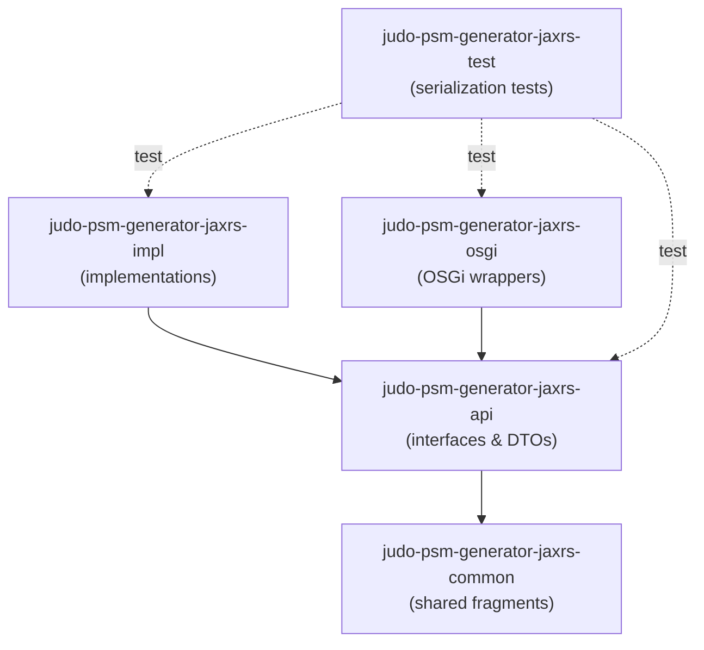
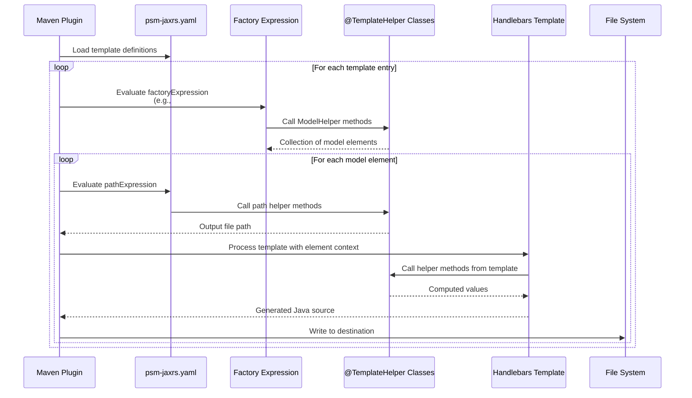
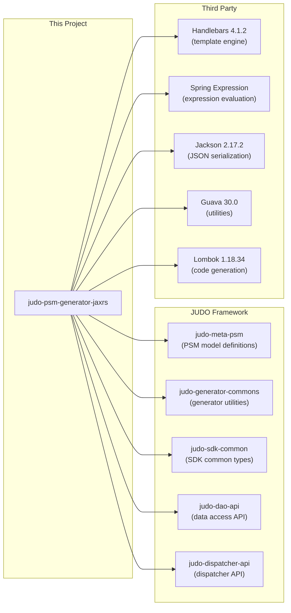

# JUDO PSM Generator JAX-RS

A PSM (Platform-Specific Model) based code generator that produces complete Jakarta RESTful Web Services (JAX-RS) implementations from JUDO framework models. Given a PSM model, it generates REST service interfaces, DTOs, service implementations, and OSGi wrappers — everything needed for a fully typed REST API layer.

## What It Generates

The generator produces four layers of Java code from a single PSM model:

| Layer | Module | What Gets Generated |
|-------|--------|-------------------|
| **API** | `judo-psm-generator-jaxrs-api` | REST service interfaces, request/response DTOs, enumerations, query customizers, range objects, error/detail classes, application configuration |
| **Implementation** | `judo-psm-generator-jaxrs-impl` | Concrete service implementations, application config implementations, REST utility classes |
| **OSGi** | `judo-psm-generator-jaxrs-osgi` | OSGi component wrappers with `@Component` declarations for service registration |
| **Common** | `judo-psm-generator-jaxrs-common` | Shared template fragments (e.g., license headers) used by all layers |

## How It Works

The generator uses **Handlebars templates** combined with **Java helper classes** to transform PSM model elements into Java source files. Each module contains:

1. A `psm-jaxrs.yaml` configuration that maps templates to model elements
2. `.hbs` (Handlebars) template files that define the generated code structure
3. Helper classes (annotated with `@TemplateHelper`) that provide data access and transformation logic



## Module Dependency Structure



## Usage

Add the generator as a Maven plugin in your project:

```xml
<plugin>
    <groupId>hu.blackbelt.judo.meta</groupId>
    <artifactId>judo-psm-generator-maven-plugin</artifactId>
    <version>${judo-meta-psm-version}</version>
    <executions>
        <execution>
            <id>execute-psm-rest-generation</id>
            <phase>generate-sources</phase>
            <goals>
                <goal>generate</goal>
            </goals>
            <configuration>
                <uris>
                    <uri>mvn:hu.blackbelt.judo.generator:judo-psm-generator-jaxrs-common:${judo-psm-generator-jaxrs-version}</uri>
                    <uri>mvn:hu.blackbelt.judo.generator:judo-psm-generator-jaxrs-api:${judo-psm-generator-jaxrs-version}</uri>
                    <uri>mvn:hu.blackbelt.judo.generator:judo-psm-generator-jaxrs-impl:${judo-psm-generator-jaxrs-version}</uri>
                    <uri>mvn:hu.blackbelt.judo.generator:judo-psm-generator-jaxrs-osgi:${judo-psm-generator-jaxrs-version}</uri>
                </uris>
                <helpers>
                    <helper>hu.blackbelt.judo.psm.generator.jaxrs.PsmModelHelper</helper>
                </helpers>
                <type>psm-jaxrs</type>
                <contextAccessor>hu.blackbelt.judo.psm.generator.jaxrs.api.StoredVariableHelper</contextAccessor>
                <scanPackages>
                    hu.blackbelt.judo.generator.commons,
                    hu.blackbelt.judo.psm.generator.jaxrs
                </scanPackages>
                <templateParameters>
                    <debugPrint>true</debugPrint>
                    <apiPrefix>${project.groupId}.model-name.api</apiPrefix>
                    <implPrefix>${project.groupId}.model-name.impl</implPrefix>
                    <osgiPrefix>${project.groupId}.model-name.osgi</osgiPrefix>
                    <generateOpenApiAnnotations>true</generateOpenApiAnnotations>
                    <baseUrl>base-url-of-your-application</baseUrl>
                    <authenticationUrl>authentication-url</authenticationUrl>
                    <specificationVersionNumber>version-number-of-your-specification</specificationVersionNumber>
                </templateParameters>
                <psm>
                    mvn:your.psm.model.group.id:your.psm.model.artifact.id:your.psm.model.version!model-name-in-jar.model
                </psm>
                <destination>${basedir}/target/generated-sources</destination>
            </configuration>
        </execution>
    </executions>
    <dependencies>
        <dependency>
            <groupId>hu.blackbelt.judo.meta</groupId>
            <artifactId>hu.blackbelt.judo.meta.psm.model.[ModelName]</artifactId>
            <version>${judo-meta-psm-version}</version>
        </dependency>
    </dependencies>
</plugin>
```

Generated files are written to `target/generated-sources`.

## Template Parameters

| Parameter | Required | Description |
|-----------|----------|-------------|
| `apiPrefix` | Yes | Java package prefix for API layer (interfaces, DTOs) |
| `implPrefix` | Yes | Java package prefix for implementation layer |
| `osgiPrefix` | Yes | Java package prefix for OSGi component layer |
| `generateOpenApiAnnotations` | No | When `true`, adds Swagger/OpenAPI annotations to generated code. Defaults to `false`. |
| `baseUrl` | No | Application URL prefix for OpenAPI docs. Only used when `generateOpenApiAnnotations` is `true`. URL pattern: `{baseUrl}/api/{model-name}/{actor-name}/{actor-name}` |
| `authenticationUrl` | No | OpenID Connect URL prefix for OpenAPI docs. Only used when `generateOpenApiAnnotations` is `true`. URL pattern: `{authenticationUrl}/auth/realms/{realm-name}/.well-known/openid-configuration` |
| `specificationVersionNumber` | No | API version number for OpenAPI specification. Only used when `generateOpenApiAnnotations` is `true`. |
| `debugPrint` | No | When `true`, includes debug comments in generated code showing source template and expressions |

## Helper Class Architecture

All helper classes extend `StaticMethodValueResolver` and are annotated with `@TemplateHelper`. They are called from Handlebars templates via `#methodName(args)` syntax.

```mermaid
classDiagram
    class StaticMethodValueResolver {
        <<abstract>>
    }

    class ModelHelper {
        +modelWrapper() PsmModelResourceSupport
        +allAccessPointActor(model) Collection
        +allExposedTransferObjectWithOperation(model) Collection
        +allTransferObject(model) Collection
        +allEnumType(model) Collection
        +allRange(model) Collection
        +allQueryCustomizer(model) Collection
    }

    class StoredVariableHelper {
        +bindContext(context) void
        +getApiPrefixLocal() String
        +isGenerateOptionalTypes() boolean
        +isGenerateOpenApiAnnotations() boolean
    }

    class JavaApiHelper {
        +namedElementApiFqName(element) String
        +applicationClassName(element) String
        +primitiveDataTypeDefinition(attr) String
        +enumFqName(element) String
    }

    class JavaNamespaceHelper {
        +safeName(name) String
        +fqName(element) String
        +namedElementPackageName(element) String
    }

    class ObjectTypeHelper {
        +isActorType(object) boolean
        +getEntity(object) TransferObjectType
        +classNameForResponse(object) String
        +classNameForRequest(object) String
    }

    class OperationHelper {
        +toJAXRSPath(operation) String
        +isBoundOperation(operation) boolean
        +isCustomOperation(operation) boolean
    }

    class AttributeHelper {
        +attributeTargetTypeDefinition(attr) String
        +isOptionalAttribute(attr) boolean
    }

    class RelationHelper {
        +decorateWrapperType(relation) String
        +relationTargetTypeDefinitionForResponse(rel) String
    }

    class JavaImplHelper {
        +getImplPrefixLocal() String
        +implClassName(element) String
        +applicationImplClassName(element) String
    }

    class JavaOsgiHelper {
        +getOsgiPrefixLocal() String
        +osgiClassName(element) String
        +applicationOsgiClassName(element) String
    }

    StaticMethodValueResolver <|-- ModelHelper
    StaticMethodValueResolver <|-- StoredVariableHelper
    StaticMethodValueResolver <|-- JavaApiHelper
    StaticMethodValueResolver <|-- JavaNamespaceHelper
    StaticMethodValueResolver <|-- ObjectTypeHelper
    StaticMethodValueResolver <|-- OperationHelper
    StaticMethodValueResolver <|-- AttributeHelper
    StaticMethodValueResolver <|-- RelationHelper
    StaticMethodValueResolver <|-- JavaImplHelper
    StaticMethodValueResolver <|-- JavaOsgiHelper
```



## Code Generation Sequence

This diagram shows how a single template is processed to generate a Java source file:



## External Dependencies



## Building from Source

```bash
# Full build with tests
mvn clean install

# Run tests only
mvn clean test

# Run a specific test
mvn test -Dtest=SerializationTest
```

Requires **Java 21** and **Maven 3.9.4+**. A Maven wrapper (`./mvnw`) is included.

## License

Eclipse Public License 2.0 (EPL-2.0) — see [LICENSE.txt](LICENSE.txt).

Plugin documentation: [judo-meta-psm on GitHub](https://github.com/BlackBeltTechnology/judo-meta-psm)
